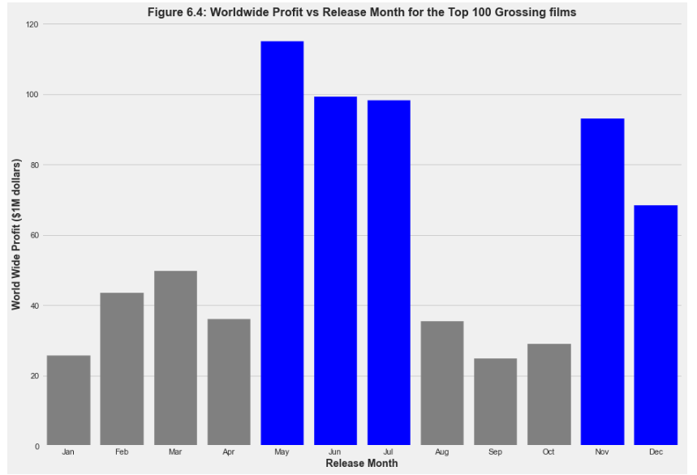
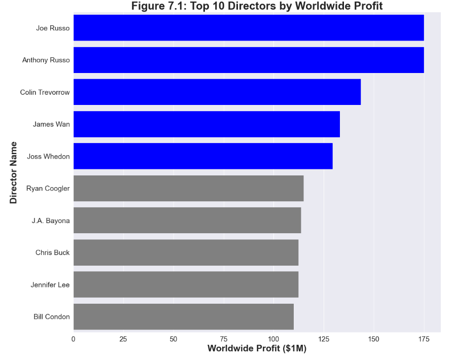
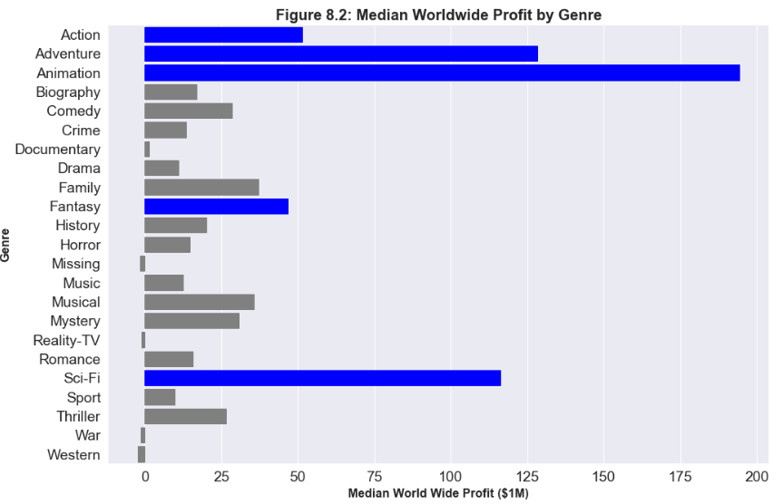

# Microsoft Movie Studios Viability Analysis
***

# Overview
Analysts at Business Wire estimate that the global film and video market will reach $410.6 billion by 2030. Microsoft is uniquely situated to leverage its existing technology holidings to redefine the film industry by crafting a one stop shop platform which manages the entire process from preproduction to filming to distribution. Microsoft's executives are in search of actionable ways to ensure successful movies are produced as they launch a new movie studio that is well supported from its onset. 

# Business Understanding:
Microsoft is uniquely situated to leverage its existing technology holidings to redefine the film industry by crafting a one stop shop platform which manages the entire process from preproduction to filming to distribution. Microsoft's executives are in search of actionable ways to ensure successful movies are produced as they launch a new movie studio that is well supported from its onset. 

The project has the following guiding questions:
* When is the best time of year to release a movie?
    - Find trends in the profit of movies based on their release month among the most profitable movies.
* Which director makes the most profitable movies?
    - Find directors who have proven track record of making films that generate profits worldwide.
* Which genres of movies make the most profit at the box office?
    - Determine pattern among succesful movie launches including the type and time of year they are released.
 
 # Data Understanding and Analysis
***
## Source of Data
The datasets used in this project are from the following sources:
* [IMDB](https://www.imdb.com/)
   - Type: sql database 
      - Resources used: The following tables:
          - movie_basics 
            - contains information about the following attributes:
              - movie_id  <- string
              - primary_title <- string
              - original_title <- string
              - start_year <- int
              - runtime_minutes <- float
              - genres <- string
           - movie_ratings 
             - contains information about the following attributes:
               - movie_id <- string
               - averagerating <- float
               - numvotes <- string
            - persons
              - contains information about the following attributes:
                - person_id <- string
                - primary_name <- string
                - birth_year <- float
                - death_year <- float
                - primary_profession <- string
             - directors
               - contains information about the following attributes:
                 - person_id <-string
                 - movie_id <- string

* [TheMovieDB](https://www.themoviedb.org/)
    - Type: csv file
         - contains information about the following attributes:
             - genre_ids
             - id
             - original_language
             - original_title
             - popularity
             - release_date
             - title
             - vote_average
             - vote_count
* [Box Office Mojo](https://www.boxofficemojo.com/)
    - Type: csv file
         - contains information about the following attributes:
             - title
             - studio
             - domestic_gross
             - foreign_gross
             - year
* [The Numbers](https://www.the-numbers.com/)
    - Type: csv file
         - contains information about the following attributes:
             - id
             - movie (name)
             - production_budget
             - domestic_gross
             - worldwide_gross
             - release_year
             - release_month
## Description of Data
***
In order to determine answers to my guiding questions, first I needed to import relevant libraries and packages. 

- <code>sqlite3</code>: a library that provides a SQL interface that allows accessing and manipulating SQL database
- <code>pandas</code>: a data analysis and manipulation library which allows for flexible reading, writing, and reshaping of data
- <code>numpy</code>: a key library that brings the computationaly power of languages like C to Python
- <code>matplotlib</code>: a comprehensive visualization library
- <code>seaborn</code>: a data visualization library based on matplotlib 

I used methods like <code>.info()</code>, <code>.head()</code> to review data shape and statistics. I alos used <code>.dropna()</code> to remove missing values from dataframes if that data was less than 1% of the overall data within a column. I replaced values by using a combination of <code>.fillna()</code> and <code>.median()</code> replace missing values with the median value. I combined dataframes using <code>.merge()</code> and <code>.replace()</code>to ensure that dataframe queries yielded results that I could analyze.

# Question 1: When is the best time of year to release a movie?
***
For the first question I looked for correlations between attributes for the most profitable films. I explored data related to this question using visualizations created with <code>seaborn</code> and <code>matplotlib</code>.

## Visualization for Question 1

# Question 2:  Which director makes the most profitable movies?
***
For the second question I looked at looked for correlations between the director of a movie and the profit for the top 100 most profitable movies. I explored this question by sorting values in a combined data frame using <cod>.sort_values()</code> along with visualizations created with <code>seaborn</code> and <code>matplotlib</code>

## Visualization for Question 2

# Question 3:  Which director makes the most profitable movies?
***
For the second question I looked at looked for correlations between the director of a movie and the profit for the top 100 most profitable movies. I explored this question by sorting values in a combined data frame using <cod>.sort_values()</code> along with visualizations created with <code>seaborn</code> and <code>matplotlib</code>

## Visualization for Question 3

# Conclusion
***
## Insights
After look at relationships between release month and worldwide profit generation I found that the best months to release a movie are May, June, July, November and December. With __May__, __June__ and __July__ (Summer months) yielding the largest profits in the top most profitable films. 
When viewing the top directors of the top 100 most profitable movies, I found that __Joe and Anthony Russo__ directed the most profitable movies out of the top 100 most profitable movies. While Colin Treverrow, James Wan, and Joss Whedon are amongst the top 5 directors to choose from when choosing directors based on their ability to create profitable movies. 
Finally, after looking for patterns between genre and worldwide profit, I found that while __Animation__ is the best genre of movie to make with Adventure, Action, Sci-Fi and Musicals rounding out the top five best genres to create based on worldwide profit. 

## Recommendations
Create movies that are __Sci-Fi, __Animation__ or __Adventure films__ with a budget of approximately 215 million dollars. When creating movies, use effective directors, specially choose a director like *Joe Russo, Anthony Russo, Colin Treverrow, James Wan or Joss Whedon* who have demonstrated successful direction of profitable movies on the worldwide stage.  If the film you launch is in the Sci-Fi genre, release it during May.  If the film you launch is in the Animation genre, launch it during June or July.  If the film you launch is in the Adventure genre, launch it during November. This will allow the new Microsoft studio to diversify their entry into the large video content space as the median worldwide profit for these films was found to be around __$200 million dollars__.

# Future Work
* Gather and analyze data on the genre of movies each director is known for.
* Use webscraping tools like <code>beautifulsoup</code> to find valuable insights from the film ratings and advertising budgets.

Please review my full analysis in [my Jupyter notebook](https://github.com/dataeducator/dsc-phase-1-project-v2-4/blob/master/student.ipynb) or [my presentation](https://link-url-here.org)my presentaion.
You may reach out to __Tenicka Norwood__ at t.terell.norwood@gmail.com.

# Repository Structure

 """
 ├── README.md                                           <- Overview for project reviewers
 ├── data_analysis.ipynb                                 <- Documentation of Exploratory Data Analysis in Jupyter notebook
 ├── data_preparation.ipynb                              <- Documentation of Data cleaning in Jupyter notebook
 ├── project_format.ipynb                                <- General project format in Jupyter notebook
 ├── microsoft_movie_studios_viability_analysis.ipynb    <- Documentation of Full Analysis in Jupyter notebook
 ├── microsoft_analysis_notebook                         <- PDF version of Full Analysis shown in Jupyter notebook
 ├── zippedData                                          <- Externally sourced data  
 ├── Images                                              <- Includes images generated from python code and sourced externally 
"""

